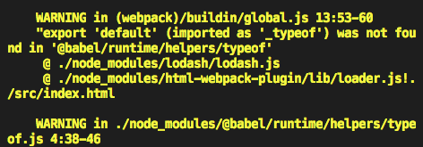

# 2-1 webpack基础配置

## webpack安装

- 安装本地wbepack 
- webpack webpack-cli -D

```
yarn init -y //初始化一下
yarn add webpack webpack-cli -D

//写了src/index.js 

webpack
```

## webpack可以进行0配置

- 打包工具->输出后的结果(js模块)
- 打包 默认支持js的模块化

## 手动配置webpack

- 默认配置文件名字 webpack.config.js


# 2-2 webpack打包出的文件解析

默认情况下是默认函数，默认情况下会执行。

//key->模块路径
//value函数


```
scripts:{

    "build":"webpack --config webpack.config.my.js"
}

//--config 执行配置文件 
```

```
//cmd中写 有了--才会觉得后面的是参数
npm run build -- --config webpack.config.my.js 
```

# 2-3 html插件

通过localhost去启动。不想每次都是在文件夹下打开路径

```
yarn add webpack-dev-server -D
```

`webpack-dev-server`不会去打包文件。而是生成内存中的打包，

把build文件夹删除掉，再`yarn run server`,发现localhost:3000没有文件了。所以需要index.html文件，把build的文件插入进index.html里面。由html插件来完成

# 2-4 样式处理（1）

- 有时候希望我自己写的优先级更高，怎么弄呢？`insertAt`

```
{
            test:/\.css$/,
            use:[
                {
                    loader:'style-loader',
                    options:{
                        insertAt:'top' //插入到顶部
                    }
                },'css-loader']
        },
```

# 2-5 样式处理2

- 打包以后发现写在html中的css是打包在html文件里面，写在css文件里面的打包在js文件中，那么能不能抽离呢？

 MiniCssExtractPlugin

- 自动提前缀 postcss autoprefixer

    postcss.config.js

- 怎么把css打包压缩，就是优化。

这里就需要一个插件 `optimize-css-assets-webpack-plugin`

```
 optimization:{ //优化项
        minimizer:[
            new OptimizeCss()
        ]
    },
```

- js的压缩

`uglifyjs-webpack-plugin`

```
yarn add uglifyjs-webpack-plugin -D
```
# 2-6 转化ES6语法

- es6->es5

把pro改成dev,这样就不会报错啦，optimization下的minimizer是在pro环境下才会执行的，dev不会

```
yarn add babel-loader @babel/core @babel/preset-env -D
```

```
{
            test:/\.js$/,
            use:{
                loader:'babel-loader',
                options:{ //用babel-loader 需要把es6-es5
                    presets:[
                        '@babel/preset-env'
                    ]
                }
            }    
        },
```
- 在index.js里面写一些高级的js语法 ，es7

```
class A{  //new A() a=1
    a=1
}
```

`yarn add @babel/plugin-proposal-class-properties -D`

```
{
            test:/\.js$/,
            use:{
                loader:'babel-loader',
                options:{ 
                    presets:[
                        '@babel/preset-env'
                    ],
                    plugins:[ //在这里配置
                        '@babel/plugin-proposal-class-properties'
                    ]
                }
            }    
        },
```

@log装饰器，会出现编译的时候报错。

这时候会提示需要装饰器的插件,可以在babel官网上搜索[babel-plugin-proposal-decorators](https://babeljs.io/docs/en/babel-plugin-proposal-decorators)

`yarn add @babel/plugin-proposal-decorators -D`

# 2-7 处理js语法及校验

1. babel-runtime

a.js里面写了`class B ` 再 `webpack`,会发现一个恶心的事情就是在bundle.js里面，`_classCallCheck`,class A和B都有这个，就说明这个类校验了两次，

在a.js里面写上promise和

```
 regeneratorRuntime is not defined
```

打包以后会发现报错，这是因为没有将它进行转化，会默认成一个自带的API ,因此在babeljs里面搜索 [@babel/plugin-transform-runtime](https://babeljs.io/docs/en/babel-plugin-transform-runtime#docsNav)

配置了以后，webpack,发现了警报，意思说他跑去node_modules下去找了。



因此加上一个exclude,

2. babel-polyfill

```
'aaa'.includes('a')
```

上面的一个插件说了实例上的方法他不会帮你解析，建议你用polyfill.

`yarn add @babel/polyfill --save`

>没看出什么变化 就这样吧

3. 怎么去给js加校验 [eslint](https://eslint.org)

`yarn add eslint eslint-loader -D`

```
 rules:[  //loader默认是从右到左，从下到上执行
         {
            test:/\.js$/,
            use:{
                loader:'eslint-loader',
                options:{
                    enfore:'pre' //previous  在普通loader之前执行， post在普通loader之后执行
                }
            }

         },

```

# 2-8 全局变量引入问题

```
yarn add jquery --save

```

```index.js
import $ from 'jquery'
console.log(window.$) //发现这个$并不会暴露给window,那么有什么方案呢？
```

1. 可以使用`expose-loader`暴露全局的loader,内联的loader,loader分为：
    - 内联的loader
    - pre 前面执行的loader
    - normal 普通loader
    - post 后置loader 


 `yarn add expose-loader -D`
 

 ```
import $ from 'expose-loader?$!jquery' //把jquery暴露成$，暴露到全局上

console.log(window.$)
 ```

 2. 如果觉得上面的方式恶心，可以用下面的，在webpack里面配置

 ```webpack.config.js
{
            test:require.resolve('jquery'),
            use:'expose-loader?$'
        },
 ```

``` index.js
import $ from 'jquery'

console.log(window.$)
```

3. 我觉得上面的方式不友好，希望默认的就可以拿到`$`

引入webpack的插件，webpack.providePlugin

```
new webpack.ProvidePlugin({
    $:jquery//在每个模块里面都注入$
})
```

4. 线上cdn,要加入externals


# 2-9 webpack打包图片的

1. 在js中创建图片引入
2. 在css中background url 
3. img src

- file-loader

    `yarn add file-loader -D` -解析js里面的img

    ```
    {
                test:/\.(png|jpg|gif)$/,
                use:'file-loader'
            },

    ```

- html-loader

    `yarn add html-withimg-loader -D`-专门解析html里面的img

    ```
    {
                test:/\.html$/,
                use:'html-withimg-loader'
            },

    ```


    可能图片非常小，我们不希望他发送http请求，因此转化为base64的比较好

- url-loader    

`yarn add url-loader -D`

```
 {
            test:/\.(png|jpg|gif)$/,
            //做一个限制 当我们的图片 小于多少k的时候 用base64来转化
            //否则 用file-loader产生真实的图片
            use:{
                loader:'url-loader',
                options:{
                    limit:200*1024
                }
            }
        },
```

>file-loader打包的是带hash的图片

# 2-10 打包文件分类

- outputPath指定文件的打包的地址

```
use:{
                loader:'url-loader',
                options:{
                    limit:1 ,//1个字节
                    outputPath:'img/'
                }
            }
```
- 让访问图片等等的资源加上域名

```
 publicPath:'http://www.zhihu.com'
```

- 只处理图片的访问路径

    ```

    {
                test:/\.(png|jpg|gif)$/,
                //做一个限制 当我们的图片 小于多少k的时候 用base64来转化
                //否则 用file-loader产生真实的图片
                use:{
                    loader:'url-loader',
                    options:{
                        limit:1 ,//1个字节
                        outputPath:'/img/',
                        publicPath:'http://www.zhifu.cn'
                    }
                }
            }
            
    ```