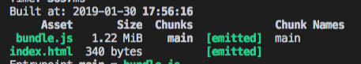
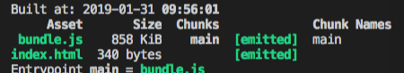
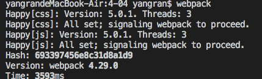
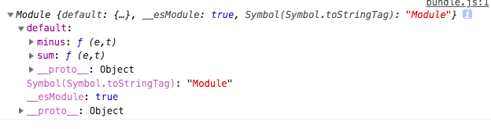

# 4-01 npParse

```
yarn add webpack webpack-cli html-webpack-plugin @babel/core babel-loader @babel/preset-env @babel/preset-react -D
```

迅速自己搭建一下，public下面存放html文件

现在的情况是很多人都会在项目中用到jquery,
 `yarn add jquery`,使用的时候可能是这样使用`import jquery from 'jquery`，webpack有个特点，他会先找到入口，然后通过入口来解析，这里会先找到jquery,然后再找jquery有没有依赖，然后再去打包。但是我们很明确jquery中不会使用其他的模块，它是一个独立的模块，因此我们不需要webpack来解析。这里就可以用到noparse不去解析这个模块

```
 noParse:/jquery/,//不去解析jquery中的依赖库
``` 

# 4-02 ignorePlugin

下个优化点，在我们匹配js的过程中啊，默认情况下他也回去找node_modules,这时候一般排除

`exclude:/node_modules/`
`include:path.resolve('src')`

在我们引用其他的一些第三方插件的时候可能还会有些优化，比如说可能会用到`moment`

```
yarn add moment --save
yarn add webpack-dev-server -D
```

在index.js中引入moment.

打包发现这个文件非常大，但是我们实际上只引用了这么一个插件



打开`moment`这个包，找package.json,默认会先找到main->./moment.js->搜下`require`-> aliasedRequire('./locale/' + name)->这个文件放了很多语言包，那么就很大

我不能把他们都引用进来，我只需要中文语言包。

```
//设置语言
moment.locale('zh-cn');

//手动引入所需要的语言包
import 'moment/locale/zh-cn'

let r=moment().endOf('day').fromNow();
console.log(r)
```
# 4-03 dullPlugin

动态链接库

`yarn add react react-dom`

在src/index.js里面用react写，webpack加上devServer.

`yarn run build`打包后发现文件是非常大的。



我们现在能不能先把react 和react-dom先抽离出去呢？到时候打包的时候不打包这两个文件，因为他们是不变的属于第三方库，我们认为的是可以单独的去打包react-dom.打包完了以后在开发的时候引用我们打包好的文件

先建一个测试文件，test.js和webpack.config.react.js

`webpack --config webpack.config.react.js`

那么加上library就会给它换了个名字。

```
//webpack.config.react.js
module.exports={
    mode:'development',
    entry:{
        test:'./src/test.js',
    },
    output:{
        filename:'[name].js',
        path:path.resolve(__dirname,'dist')，
        library:'ab'
    }
}
```

再`webpack --config webpack.config.react.js`，打包出来的结果test.js里面就会有ab

还有`libraryTarget`,意思是我不喜欢用var,那么我就可以把结果放到exports属性里面，也就是符合node的规范的里面exports

```
 libraryTarget:'commonjs'// commonjs var this
```

现在是react和react-dom的例子：

写好后运行`webpack --config webpack.config.react1.js`,manifest。json就会定义用到的模块以及路径，

打包完以后就在html里面引入这个文件`<script src="/_dll_react.js"></script>`,但是我们不知道它自己怎么找，我们希望引入react 的时候import React ，它会去_dll_react.js里面找，但是默认情况下他会打包，那就先跟它说先去dll动态链接库里面去找，找不到的时候再打包。那这时候改怎么做，回到正式的配置文件`webpack.config.js`引入动态链接库文件

```
new webpack.DllReferencePlugin({
            manifest:path.resolve(__dirname,'dist','manifest.json') //这样就会先查找manifest文件。
        }),
```
再`npm run build`,发现文件的体积小了，这是因为他会去先找打包好的文件。
`npm run dev`查看运行后的结果，这就相当于我们先把打包后的结果准备好，到时候直接去用打包后的结果

>这里没听明白

# 4-04 多线程打包 happypack

先下载happypack.

webpack.config.js中.
项目比较大，需要happypack的时候才会比较大

```
 rules: [
      {
        test: /\.js$/,
        exclude: /node_modules/,
        include: path.resolve('src'),
        use:'Happypack/loader?id=js' //标志一下不只是js要多线程，可能css也要多线程,
      },
```

```
new  Happypack({
      id:'js',
      use:[{
        loader: 'babel-loader',
          options: {
            presets: [
              '@babel/preset-env',
              '@babel/preset-react'
            ]
      }]
    }),
```
webpack一下。webpack多线程打包就是下面的样子。


# 4-05 webpack自带优化

## import 语法

1. 在test.js和index.js里面书写
2. 在开发模式下yarn run build,查看打包后的结果,我只用了sum,没用minus,它把minus也打包出来那我就不高兴了。把mode改为production看打包后的结果

```
 import calc from './test';
//import 在生产环境只能中会自动删除不用的代码
//tree shaking


 console.log(calc.sum(1,2))
```

## require语法

```
//require语法要想删除怎么办呢？
let calc = require('./test')
console.log(calc)
```

1. `yarn run dev`,提示我们sum并不是一个函数，console一下calc，看下它是什么东西,会发现是一个模块。因为是es6导出，所以会放到default里面，



2. `yarn run build`查看打包后的结果，发现打包的时候minus也打包进来了，说明require不支持tree shaking 

3. 作用域提升

  ```

  //scope hosting 作用域提升
  let a=1;
  let b=2;
  let c=3;
  let d=a+b+c;//在webpack中自动省略一些可以简化的代码
  console.log(d,'--------------');

  ```
# 4-06 抽离公共代码

抽离公共代码是在多个页面中，需要有公共的部分才需要抽取代码，这个时候就需要配置多入口。

1. 来个文件叫a.js,b.js,other.js
2. 设置多个entry
3. `yarn run build`,开始变得不一样，我这里的是加了动态的'@babel/plugin-syntax-dynamic-import',公共的代码是抽离出来的,这里只有在import的情况下才会行的。require不行

4. 抽离代码

```
  optimization:{
        splitChunks:{//分割代码块
            cacheGroups:{//缓存组 我要缓存我的某些代码
                common:{//公共的模块 希望单独抽一个文件
                    chunks:'initial',//从那开始提取代码，从入口开始提取
                    minSize:0,//大于多少个字节需要抽离
                    minChunks:2,//引用多少次需要抽离
                }

            }
        }
    },
```

5. 假如有一个c.js,`import $ from 'jquery'`,这个在`other.js`和其他的文件里面也有，

写一个vendor,就是第三方，第三方里面写一些正则，就是我只找的，代码执行是从上到下，所以要注意下顺序

```
vendor:{
          priority:1,//权重，
          test:/node_modules/,//把你抽离出来
          chunks:'initial',
          minSize:0,
          minChunks:2
                }
```

# 4-07 懒加载

假如我写一些资源，有个按钮，点击按钮就会加载资源。

新建source.js.路由懒加载的实现靠的就是import语法。

# 4-08 热更新

每次页面更改都会导致重新刷新，我们希望的是只更改一部分。当组件更新了只更新我们的组件。

1.  hot:true,//启用热更新
2. 添加插件的支持。
3. index.js

```
import str from './source';
console.log(str)
```
你会发现这时候的热更新插件没起作用

4. import 只能写在页面的顶端


